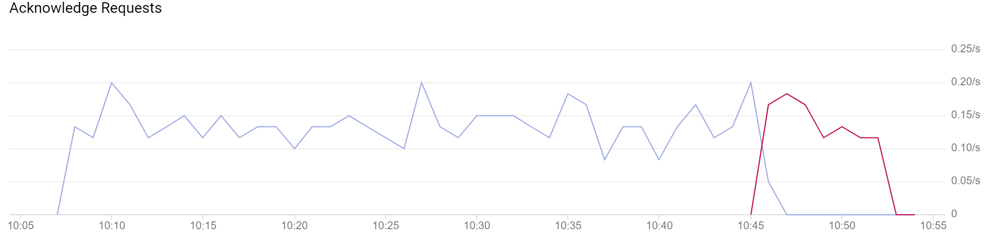
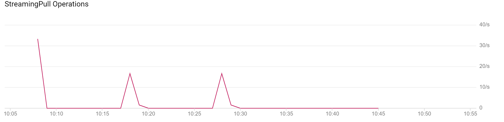
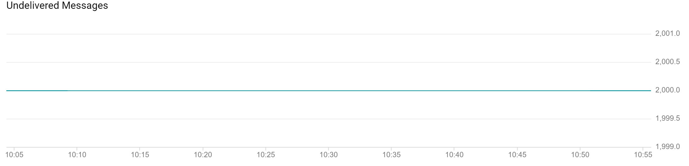
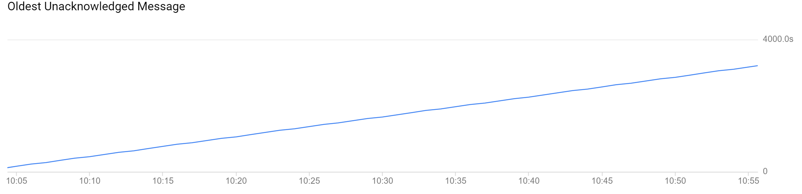

## Summary

This scenario started with publishing 2 batches of 1000 messages, waited 5 minutes, and then started acking at a random interval, averaging 0.15 messages per second.

Note that the "received rate" graph below uses the Node client's internal queuing / management to deliver 1 message a time. Subscriber actually received periodic batches of ~315 messages.

The subscriber received an initial batch of 316 messages, and then later another batch of 315 messages. After about 40 minutes of acking, all ack attempts give an expired response. Undelivered message count stayed at constant 2000 the whole time.

## Scenario

- Topic: `gps-test-topic-b3966b7f1b`
- Subscription: `gps-test-sub-bc94d76a90`

```JSON
{
    "name": "variable ack time",
    "publisherClientOptions": {
        "grpc.http2.lookahead_bytes": 4096,
        "grpc.http2.bdp_probe": 0
    },
    "publisherTopicOptions": {
        "batching": {
            "maxMessages": 1000,
            "maxMilliseconds": 100
        }
    },
    "subscriberSubscriptionOptions": {
        "ackDeadline": 30,
        "flowControl": {
            "maxMessages": 1,
            "allowExcessMessages": false
        },
        "streamingOptions": {
            "maxStreams": 1
        }
    },
    "subscriptionAckDeadlineSeconds": 10,
    "processingTimeMilliseconds": 6666,
    "subscriberCount": 1,
    "subscriberStartDelayMinutes": 5,
    "messageBytes": 50,
    "publisherCount": 1,
    "initialMessageCount": 2000,
    "messagesPerPublishBatch": 0,
    "batchesPerMinute": 0.5,
    "publishDurationMinutes": 0,
    "testDurationMinutes": 60
}
```

## Graphs









## Output

```
Scenario variable ack time:
Total duration: 49.76 minutes
Published messages: 2000
Total received messages: 377
Unique received internal IDs: 377
Unique acked internal IDs: 376
Duplicate received messages: 0
Time until first duplicate: N/A
Number of errors: 0
Time until first error: N/A
Time since last message: 0.10 minutes
Received messages:
      12.00 ┼                                          ╭╮
      11.00 ┤      ╭╮    ╭╮         ╭╮                ╭╯╰╮
      10.00 ┤      │╰╮   ││         ││      ╭╮     ╭╮ │  │
       9.00 ┤    ╭╮│ │╭─╮││     ╭╮  │╰╮╭─╮  │╰╮    │╰╮│  ╰╮
       8.00 ┤    │╰╯ ││ │││╭─╮╭─╯╰╮ │ ││ ╰──╯ ╰─╮ ╭╯ ╰╯   ╰──╮
       7.00 ┤    │   ╰╯ ││││ ││   ╰─╯ ││        │ │          │
       6.00 ┤    │      ╰╯╰╯ ╰╯       ╰╯        ╰╮│          ╰
       5.00 ┤    │                               ╰╯
       4.00 ┤    │
       3.00 ┤    │
       2.00 ┤    │
       1.00 ┤    │
       0.00 ┼────╯
```